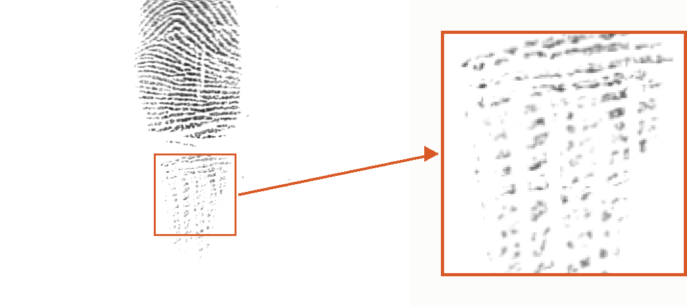
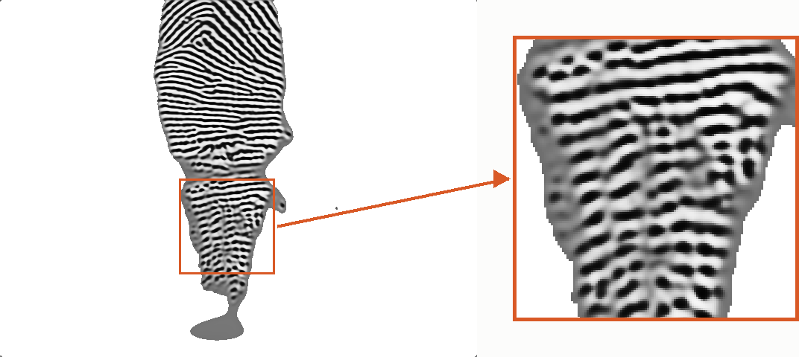
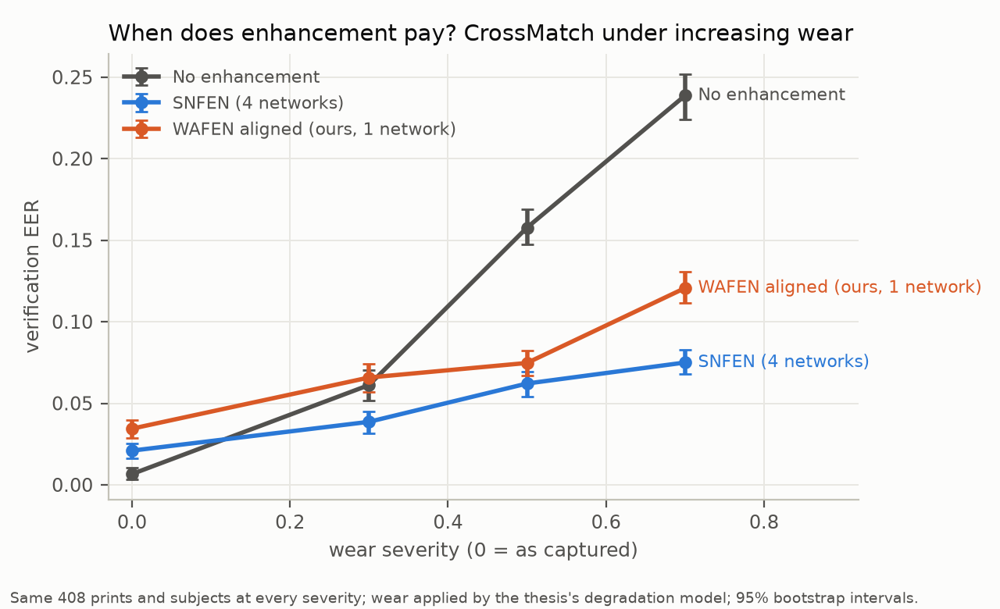
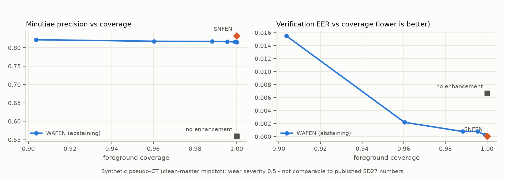
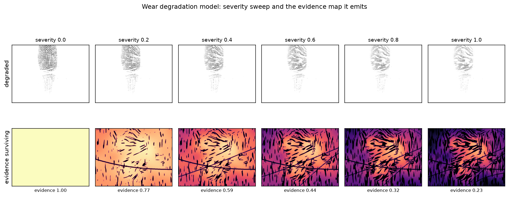

# Restoring Worn Fingerprints

Master's thesis project: **enhancement of fingerprints degraded by occupational wear,
ageing and skin damage**, for large-scale civil identity systems.

Most fingerprint enhancement research targets *latent* prints — crime-scene marks where
the ridge signal is present but occluded by background noise. This project targets a
physically different problem: prints where the ridge signal has been **attenuated at the
source** by manual labour, ageing, dryness or scarring. The failure mode is not a missed
minutia in a forensic lab; it is a failure to enrol at a ration shop, and exclusion from
a service.

**A worn print, before and after** — a real FVC2004 capture whose lower region is
fragmented into disconnected dots by dry, worn skin (NFIQ 2 = 26), and the same print
reconstructed by this project's final model (NFIQ 2 = 50). The boxed region is enlarged
3× on the right:

| Raw degraded input | Enhanced (domain-aligned WAFEN) |
|---|---|
|  |  |

---

## Headline results

Everything below is generated from the append-only results registry
([`results/registry/runs.jsonl`](results/registry/runs.jsonl)) — more than one hundred
evaluation rows, each carrying its git SHA, config hash and dataset manifest hash.
Confidence intervals are 1,000-resample bootstraps; "resolved" means a paired bootstrap
over the *same* comparison pairs excludes zero.

### 1. When does enhancement pay? The severity crossover

The same 408 real prints (Neurotechnology CrossMatch), degraded by the wear model at
increasing severity, evaluated under every method with everything else fixed:



| Wear severity | No enhancement | SNFEN (4 networks) | WAFEN aligned (ours, 1 network) |
|---|---|---|---|
| clean | **0.0066** | 0.0209 | 0.0344 |
| 0.3 | 0.0612 | **0.0386** | 0.0658 |
| 0.5 | 0.1577 | **0.0621** | 0.0747 |
| 0.7 | 0.2387 | **0.0750** | 0.1206 |

Enhancement is *harmful* on clean prints (every method, the state of the art included),
breakeven at light wear, and dramatically beneficial at heavy wear — our single-network
model halves the unenhanced error at severities 0.5 and 0.7 with disjoint confidence
intervals, at roughly a third of SNFEN's CPU cost (≈440 ms vs ≈1,060 ms per image).
The deployment consequence: **enhancement must be gated by input quality.**

### 2. The first controlled comparison of the literature's two main responses

The literature answers the synthetic-to-real degradation mismatch two ways: *corrected
synthesis* (train on better synthetic damage) and *post-hoc domain alignment* (adapt an
already-trained model to real prints without labels). Compared here head-to-head for the
first time — same network, same benchmark, same budget:

| Comparison (FVC2004, paired bootstrap) | EER difference | Verdict |
|---|---|---|
| **Domain alignment vs corrected synthesis** | **−0.0247 [−0.0359, −0.0140]** | **resolved: alignment better** |
| Enhancement vs none on degraded prints (MINEX) | −0.0221 [−0.0461, −0.0060] | resolved: enhancement better |
| SNFEN vs none (FVC2004 aggregate) | −0.0095 [−0.0208, +0.0017] | not resolved |
| SNFEN vs none under a different extractor (LEADER) | −0.0141 [−0.0284, −0.0008] | resolved |

Notably, the thesis's central comparison resolves more decisively than the state of the
art's own improvement claim on the same benchmark.

### 3. Minutiae precision, and abstention put to the test

On the held-out synthetic test split (1,290 wear-degraded impressions, pseudo ground
truth from each finger's clean master, Cappelli's correspondence protocol at 14 px / π⁄9):



| Condition | Precision | Recall | F1 |
|---|---|---|---|
| No enhancement | 0.559 | 0.397 | 0.464 |
| SNFEN | **0.832** | 0.575 | 0.680 |
| **WAFEN (ours)** | 0.815 | **0.634** | **0.713** |

Enhancement raises minutiae precision by 26 points; our one-pass network matches the
four-network SOTA's precision within 2 points and leads on F1. The project's designed
hypothesis — *that declining to reconstruct low-confidence regions improves matching
more than hallucinating them* — was **tested and falsified** on both synthetic and real
data: the precision-coverage curve is flat while EER worsens as coverage drops.

### 4. Image quality does not predict matching

Across three independent experimental axes, NFIQ 2 (the standard quality score) improved
substantially while matcher EER stayed flat or worsened — e.g. on FVC2004 our arm-1 model
lifts NFIQ 2 from 46.0 to 59.5, level with SNFEN, while its EER remains above the
unenhanced control. Systems that gate enrolment on quality scores are measuring the
wrong thing.

---

## What's in the box

**WDM — the wear degradation model** (`src/fpe/degradation/wear.py`). A physiologically
grounded model of occupational wear: ridge amplitude attenuation, flexion creases,
dryness-induced ridge fragmentation and pressure-dependent partial contact — not the
literature's blur-and-scratches latent model. Its realism is *measured*, not asserted
(distributional tests, a within-sensor domain classifier, NFIQ 2 shift):



**WAFEN — the wear-aware fingerprint enhancement network**
(`src/fpe/models/wafen.py`). A 5.46 M-parameter encoder–decoder (depth 5, 5×5
convolutions) with **five output heads** — enhanced ridge map, orientation field (as
cos 2θ, sin 2θ), ridge period, segmentation, and per-pixel confidence — so one forward
pass produces what the state of the art computes with four separate networks. CPU
inference ≈ 310 ms at 256², ≈ 440 ms at sensor resolution, against a 500 ms edge budget
and a hard ≤ 10 M parameter cap enforced in code. The ridge loss is an asymmetric
Tversky index (α = 0.7): an invented ridge costs 2.3× a missed one, because invented
minutiae are the dangerous failure in a civil-ID setting.

**Two training arms**, compared under identical conditions:

```
                       Anguli synthetic prints
                                │
                      wear degradation model
                                │
             ┌──────────────────┴──────────────────┐
   ARM 1: corrected synthesis          ARM 2: + unsupervised domain alignment
   teacher-supervised training         self pseudo-annotation of 1,160 real
   on synthetic wear only              non-test prints + consistency across
                                       photometric variations
             │                                     │
             └──────────────────┬──────────────────┘
                                │
          one evaluation harness: mindtct/bozorth3 (+ LEADER as a
          second chain), NFIQ 2, Cappelli minutiae correspondence,
          bootstrap and paired-bootstrap statistics
                                │
                    results/registry/runs.jsonl
                                │
            scripts/make_tables.py · make_*_figure.py
              (the results chapter, regenerated)
```

Arm 1 was additionally probed with teacher distillation on real prints, a minutia-aware
loss (extra weight inside 7 px disks at the target's skeleton endpoints and
bifurcations), pair-consistent training (two independently damaged, pixel-aligned views
per print with a consistency penalty), confidence blending, and an abstention sweep —
each a single-variable change, each in the registry. None moved the matcher; arm 2 did.
The diagnosis that chain of experiments isolates — *the degradation model itself is
corrected synthesis's ceiling* — is one of the thesis's main findings.

**The evaluation harness** (`src/fpe/eval/`, `src/fpe/metrics/`). Manifest-driven
datasets with per-image checksums; blake2b-hashed train/val/test splits so no finger
crosses a split; seeded impostor subsampling; failure-to-acquire as a first-class
metric; resumable, atomic caching throughout (every long job on this project survived
being killed, because the machine made sure that was tested).

---

## Reproducing

Fingerprint imagery is never committed (licence terms); the repository carries
manifests, checksums and split definitions, and every pipeline stage rebuilds from them.

```bash
# environment: Windows, Python 3.11, GTX 1650-class GPU (4 GB) or CPU
python -m venv .venv
.venv/Scripts/pip install -r requirements.txt   # torch 2.5.1+cu118 on this hardware

# 1. acquire datasets per docs/datasets/REGISTRY.md, verify against manifests
python scripts/make_manifest.py --verify

# 2. teacher supervision for the synthetic corpus (resumable, ~3 h)
python scripts/build_supervision.py

# 3. train arm 1  →  data/work/wafen/best.pt        (~1 h GPU)
scripts/train_simple.bat

# 4. arm 2: self-annotate real prints, then align    (~1.5 h total)
python scripts/build_pseudo_annotations.py
scripts/align_domain.bat

# 5. evaluate (each writes registry rows)
python experiments/baseline_nbis.py --dataset fvc2004 --method WAFEN \
    --checkpoint data/work/wafen_da/best.pt
scripts/run_u9.bat        # minutiae precision + the precision-coverage curve
scripts/run_u12.bat       # full benchmark: held-out sets, severity axis, strata
python experiments/paired_compare.py --a none --b SNFEN   # paired significance

# 6. regenerate every table and figure from the registry
python scripts/make_tables.py --write
python scripts/make_precision_figure.py
python scripts/make_severity_figure.py
```

The long-running steps are shipped as crash-tolerant `.bat` launchers: one process,
atomic checkpoints, automatic resume and retry — written for an 8 GB machine that
enforced humility about reliability.

## Results discipline

Three rules, enforced in code rather than by promise:

1. **No number is reported that a script did not produce.** Every metric lands in the
   registry with provenance; tables and figures are queried from it, never typed.
2. **No test-set leakage.** FVC2004 and CrossMatch are held out in code — training
   loaders refuse them — and the synthetic/real split discipline is tested.
3. **Headline metrics are matcher EER and minutiae precision**, not pixel scores.
   PSNR/SSIM appear only where clean ground truth exists; NFIQ 2 is reported as a
   distribution shift and never as a headline (see finding 4 for why).

## Layout

```
src/fpe/        the fpe package: data, degradation, models, metrics, eval
configs/        one YAML per experiment
experiments/    thin entrypoints: training, baselines, benchmark, paired comparisons
results/        append-only run registry + generated tables and figures
docs/           decisions (ADRs), dataset registry, literature notes, progress log, images
scripts/        setup, dataset tooling, launchers, table/figure generation, reports
paper/          thesis and paper sources
data/           gitignored — fingerprint images are never committed
```

## Documents

| File | What it is |
|---|---|
| [`STRATEGY.md`](STRATEGY.md) | Engineering strategy: framing, build order, phases, risks |
| [`PROJECT_RULES.md`](PROJECT_RULES.md) | The project's non-negotiables and working conventions |
| [`fingerprint_enhancement_thesis_plan.md`](fingerprint_enhancement_thesis_plan.md) | Research plan: datasets, literature map, contributions |
| [`literature_review_fingerprint_enhancement.md`](literature_review_fingerprint_enhancement.md) | Full literature review, six eras, identified gaps |
| [`docs/datasets/REGISTRY.md`](docs/datasets/REGISTRY.md) | Dataset access tracker |
| [`docs/decisions/`](docs/decisions/) | Architecture decision records (0001–0005) |
| [`docs/progress/LOG.md`](docs/progress/LOG.md) | Session-by-session experimental log — the thesis narrative in raw form |

## Status and roadmap

**The semester's experimental program is complete**: both training arms evaluated and
compared with paired significance tests, the precision-coverage and severity-crossover
figures generated, a 45-cell benchmark across held-out sets, severities and finger
positions, and results that survive a change of minutiae extractor.

Deferred by recorded decision to next semester: the third literature response
(unpaired translation, [ADR 0004](docs/decisions/0004-defer-arm-three.md)), the full
ablation grid ([ADR 0005](docs/decisions/0005-defer-full-ablations.md)), and the
confirmatory evaluation on the Rural Indian fingerprint database pending licence
paperwork.

## Data and licensing

No fingerprint imagery is contained in this repository. Several datasets used
(IAB Rubric, NIST, CASIA, FVC "A" subsets, LivDet) are distributed under licences that
forbid redistribution; only manifests, checksums and split definitions are versioned
here.
