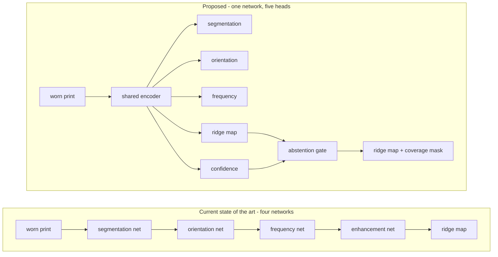

# Wear-Aware Abstaining Fingerprint Enhancement

## Summary

A single convolutional network that takes a worn fingerprint and jointly estimates
segmentation, ridge orientation, ridge frequency, an enhanced ridge map, and a per-pixel
confidence map — replacing the four separate networks of the current state of the art with
one forward pass. Every one of those labels is supplied by a physiologically grounded wear
degradation model we write ourselves, which is also the only way to obtain honest
supervision for the confidence head. At inference the network declines to reconstruct where
evidence was destroyed, and minutiae falling in abstained regions are discarded before
matching.

## Problem Frame

Supervised fingerprint enhancement is trained almost universally on synthetic *latent*
degradation — blur, scratches, occlusion, elastic distortion, compositing onto background
textures. That is a model of crime-scene evidence. Occupational and age-related wear is
physically different: ridge amplitude attenuates, ridge profiles flatten, flexion creases
persist, dry skin fragments ridges, and contact becomes partial and pressure-dependent. No
published degradation model is grounded in that physiology, and civil identity deployments
— where a failed fingerprint means a person is denied a service — are the population that
suffers for it.

Two facts sharpen where the remaining performance actually is. First, Cappelli's 2026 work
shows the field's gains came from **better orientation and frequency estimation**, not from
larger enhancement models: GBFEN, with no learned enhancement at all, reaches F1 0.286
against SNFEN's 0.306, while a GAN trained on 130,000 images reaches 0.233. Second, those
orientation and frequency estimators were themselves trained on manually annotated,
reasonably clean prints. Nobody has trained them for worn prints, because nobody had
worn-print ground truth.

Third, and the reason abstention is tractable here at all: precision is the binding
constraint, because a spurious minutia is a false identity feature. Every published method
reconstructs the whole image whether or not evidence survives there, and none offers a
principled mechanism for declining. Uncertainty estimation has been introduced to this field
but only to weight losses — never to refuse.

## Key Decisions

**The novelty is in supervision and output, not in architecture blocks.** The 2026 evidence
is that architectural sophistication has passed the point of diminishing returns in this
field. Adding attention, a deeper decoder or a generative objective is the one move most
likely to fail and least likely to survive review. The network is deliberately a plain
encoder-decoder of the shape already shown to work; what is new is that it estimates five
things instead of one, and that a degradation model we own supplies labels for all five.

**One network replaces four stages.** The current pipeline invokes segmentation, orientation,
frequency and enhancement networks in sequence. Collapsing them into one shared encoder with
five heads is a *simplification*, not an elaboration, and it converts directly into the
thesis's stated deployment goal: one forward pass instead of four, inside a 500 ms CPU
budget on hardware a village enrolment device might actually carry.

**Confidence is supervised by the degradation model's own record of what it destroyed.**
Because we synthesise the wear, we know per pixel how much ridge evidence was removed. That
is a direct supervision target for the confidence head. It is also the coupling that makes
the two contributions one contribution rather than two: *you can only abstain honestly if
you know what was destroyed, and you only know that if you built the degradation model.* No
method that inherits its degradation from someone else can train this head.

**The headline metric is matcher EER on real prints; minutiae precision on synthetic data is
the supporting mechanism.** Expert-marked minutiae ground truth is unobtainable — SD27 is
withdrawn, MUST and MOLF are unlicensed — so Cappelli's headline metric is closed to us.
Matcher EER needs no annotation and is operationally meaningful. Minutiae precision against
pseudo ground truth from clean Anguli masters then explains *why* EER moved, and is reported
as synthetic throughout, never as comparable to published SD27 numbers.

**SOCOFing is excluded, and severity is generated instead of inherited.** Supervisor guidance
rules out Kaggle-sourced training data; independently, SOCOFing measures ~200 dpi against a
declared 500 dpi. Applying our own wear model at controlled severities to real clean prints
gives a severity axis with *known* parameters rather than a vendor's undocumented
easy/medium/hard labels, and it is a better experiment for the same reason.

**Approach A is a contracted fallback, not an aspiration.** If joint multi-task training has
not converged by the end of week 4, the estimator heads are frozen or replaced by `pyfing`'s
released networks and the thesis ships the dual-head enhancer alone. Same codebase, same
data, same evaluation — a strictly smaller claim, still novel, still complete.

## Scope Cuts

Four items from the original eight-month plan are cut, and the thesis is re-framed around
what survives. Recorded here so they are declined once rather than re-litigated.

| Cut | Reason |
|---|---|
| Multi-impression fusion (Contribution 4) | Was already a reserve item. No time in five build weeks. |
| Post-hoc domain alignment arm (Joshi line) | The three-way comparison of corrected synthesis vs. alignment vs. unpaired translation needs three implementations. Reduced to two arms: wear degradation vs. latent degradation, both of which already exist in `src/fpe/degradation/`. |
| Unpaired translation arm (CycleGAN / Karabulut line) | A GAN on a 4 GB GPU inside five weeks is a bad bet, and the literature's own conclusion argues against it. |
| Demographic stratification | No acquired dataset carries demographic labels once SOCOFing is excluded. Stated as a limitation; recoverable only if CASIA approval lands. |

## Pipeline

The wear degradation model supplies the training target for all five heads simultaneously,
because it starts from a clean synthetic master whose orientation, frequency and ridge
structure are known exactly, and it records per pixel how much evidence it removed.

## Requirements

**Wear degradation model**

- R1. The model applies parametrically controlled ridge-amplitude attenuation, flexion crease
  injection, dryness-induced ridge fragmentation, and pressure-dependent partial contact,
  each independently adjustable and each grounded in a cited physiological mechanism.
- R2. Every generated image carries a machine-readable record of which effects fired with
  which parameters, and is exactly reproducible from its seed.
- R3. The model emits a per-pixel **evidence map** quantifying how much ridge evidence
  survived degradation at each location. This is the supervision target for R9.
- R4. The model emits ground-truth segmentation, orientation and frequency fields for every
  generated image, derived from the clean master rather than estimated from the degraded one.
- R5. Realism is validated by measurement, not assertion: a two-sample test on NFIQ 2 score
  distributions against real degraded prints, and a domain classifier trained to separate
  generated from real degraded prints. Both results are reported whatever they show — a
  measured realism failure is a finding, not a defect.
- R6. The model runs at controlled severity levels over **real** clean prints as well as
  synthetic masters, producing the severity-stratified evaluation set that replaces SOCOFing.

**Network**

- R7. One network estimates segmentation, orientation, frequency, enhanced ridge map and
  per-pixel confidence from a single input image in one forward pass.
- R8. Orientation is represented so that its angular periodicity is respected rather than
  learned around.
- R9. The confidence head is trained against the degradation model's evidence map (R3), not
  against dropout sampling or ensemble variance.
- R10. The enhancement objective penalises false ridges more heavily than missed ridges,
  because precision is the binding constraint.
- R11. Total parameters do not exceed 10M; single-image CPU inference does not exceed 500 ms;
  training peak memory stays within 4 GB GPU and does not drive the machine into swap.
- R12. Training data contains no test-set material of any kind — no backgrounds, textures or
  noise patterns sourced from test images. Compliance is enforced structurally, so it cannot
  be forgotten, and is stated in the thesis.

**Abstention**

- R13. At inference a coverage threshold converts the confidence map into a binary decision
  per pixel: reconstruct, or decline.
- R14. Minutiae extracted from declined regions are discarded before matching, and the
  discarded count is recorded.
- R15. The threshold is a free parameter swept at evaluation time, not a constant baked into
  the model.

**Evaluation**

- R16. Headline results are matcher equal error rate on real prints, before versus after
  enhancement, reported with bootstrap confidence intervals rather than as point estimates.
- R17. At least two independent open matchers are used, so no conclusion rests on one
  matcher's idiosyncrasies.
- R18. NFIQ 2 quality distribution shift is reported for every condition.
- R19. Minutiae precision and recall are reported against pseudo ground truth from clean
  synthetic masters, labelled as synthetic wherever they appear, and never presented as
  comparable to published SD27 figures.
- R20. Failure-to-acquire reduction is reported: the fraction of prints that move from
  yielding no usable template to yielding one.
- R21. Results are stratified by degradation severity and by finger position.
- R22. Baselines are: no enhancement, classical Gabor contextual filtering, and Cappelli's
  released GBFEN and SNFEN — all run by us on our benchmark, not quoted from his table.
- R23. An ablation isolates each claimed source of gain: wear-degraded versus latent-degraded
  training data, joint estimation versus separate pretrained estimators, abstention on versus
  off, and the asymmetric loss versus a symmetric one.
- R24. Every reported number is produced by a script and lands in the results registry with
  its git SHA, config hash and dataset manifest hash. Thesis tables and figures are generated
  from that registry.

## Acceptance Examples

- AE1. **Covers R13, R14.** Given a print whose lower third was destroyed by the wear model,
  when the network runs at the default coverage threshold, then the enhanced output marks
  that region declined, and no minutia reported to the matcher originates inside it.
- AE2. **Covers R15, R16.** Given the full evaluation set, when the coverage threshold is
  swept from 0 to 1, then a precision–coverage curve is produced on which every competing
  method appears as a single point at coverage 1.0.
- AE3. **Covers R6, R21.** Given real clean prints degraded by the wear model at three
  severity levels, when results are reported, then EER is broken out per severity level and
  the trend across severity is visible.
- AE4. **Covers R5.** Given the domain classifier trained to separate wear-model output from
  real degraded prints, when its accuracy is materially above chance, then that number is
  reported as a limitation and the thesis's realism claim is weakened accordingly rather than
  the experiment being rerun until it passes.
- AE5. **Covers R11.** Given any configuration that exceeds 10M parameters, 500 ms CPU
  inference or 4 GB of training memory, when it is evaluated, then it is out of scope by
  definition and is not reported as a result.

## Success Criteria

The thesis is complete and defensible if all of the following hold, **whether or not the
model wins**:

- The precision–coverage curve exists and is populated for our method and every baseline.
- The wear model's realism is measured and reported, in either direction.
- Every number in the thesis regenerates from the registry on a clean clone plus data.
- The comparison of wear-degraded versus latent-degraded training is complete, since that
  comparison is itself an unpublished result.

The thesis additionally *wins* if minutiae precision at matched coverage exceeds SNFEN's on
our benchmark, or if EER at equal coverage is lower. Neither is required for the thesis to
stand — which is the point of the framing.

## Schedule and Fallback Contract

Five build weeks, three writing weeks. The literature review is already drafted, which is
what makes three writing weeks feasible.

| Week | Deliverable | Gate |
|---|---|---|
| 1 | Evaluation harness end to end; matchers and NFIQ 2 wired; baselines running | A registry row exists containing a real EER from a real matcher on real images |
| 2 | Wear model, its label export, and its realism validation | The side-by-side figure: real / latent-degraded / wear-degraded |
| 3 | Unified network trains and beats the no-enhancement control | Registry rows for the first trained model |
| 4 | Confidence head, abstention, ablations | **Fallback decision point** — if joint training has not converged, drop to Approach A |
| 5 | Full benchmark, stratification, figures and tables | Results chapter generated, not typed |
| 6–8 | Writing | Thesis reproduces every number from the registry |

The week-4 gate is a contract, not a hope. Approach A — the four-stage pipeline with only the
enhancement stage replaced by our dual-head network — is a strictly smaller claim that reuses
the same code, data and evaluation, and it remains novel because the confidence supervision
is unchanged.

## Dependencies / Assumptions

- **NBIS is the critical path, and it is a week-1-day-1 item.** `bozorth3` produces the
  headline EER and `mindtct` the minutiae, and neither is installed. There is no C compiler
  on this machine at all — no gcc, no cmake, no MSVC — and WSL2's disk lives on the nearly
  full C: drive. A portable toolchain must be provisioned to E: and NBIS built natively. If
  that stalls, the contingency is `pyfing`'s LEADER extractor plus a second matcher, and that
  call is made in week 1, not discovered in week 5.
- **`pyfing` is assumed installable and runnable on the PyTorch backend.** It is Keras 3, so
  `KERAS_BACKEND=torch` should avoid the TensorFlow-on-Windows GPU dead end entirely. Verified
  as a claim about the library, not yet as a working install.
- **Anguli masters are assumed to yield exact orientation and frequency fields.** R4 depends
  on it. If the generator does not expose them, they are computed from the clean master, which
  is clean enough for the derivation to be reliable — but this is unverified.
- The second independent matcher (R17) is not yet chosen. SourceAFIS and MCC are both
  candidates and neither is installed.
- 7.8 GB of system RAM is the binding constraint more often than the 4 GB GPU. Dataloader
  workers stay at 0–2 and datasets stream rather than load.

## Outstanding Questions

**Resolve before planning**

- How is NBIS obtained on this machine — portable MinGW on E:, relocating WSL2's VHDX to E:,
  or abandoning NBIS for LEADER plus another matcher? This determines week 1.
- Which second matcher satisfies R17?

**Deferred to planning**

- How the five task losses are weighted, and whether training is staged rather than joint
  from the start.
- Whether the encoder is shared entirely or partially, and at what resolution each head
  operates.
- The exact functional form of the evidence map in R3, and whether confidence regresses it
  directly or predicts its own error against it.
- Whether real clean prints for R6 come from the Neurotechnology sets, the FVC sets, or both.

## Sources

- `literature_review_fingerprint_enhancement.md` §9 (Cappelli's simplicity correction, the
  results table, the four conclusions), §14 (evaluation practice), §15 (Gaps 1–6).
- `STRATEGY.md` §1 (comparison-study framing), §2.3 (hardware as design goal), §2.4
  (precision-first), §2.5 (registry as infrastructure).
- `docs/datasets/DATASET_DOSSIER.md` — what is acquired, what is not, and why.
- `docs/decisions/0002-evaluation-harness-first.md`, `docs/decisions/0003-chalearn-contingency.md`.
- `src/fpe/degradation/latent.py` — the nine-artefact latent model, already built; the control
  arm of the R23 ablation.
- `src/fpe/degradation/backgrounds.py` — the category-partitioned DTD bank that satisfies R12.
- Cappelli, *pyfing* — GBFEN, SNFEN, LEADER, and the released orientation and frequency
  networks: baseline, fallback and starting codebase.
