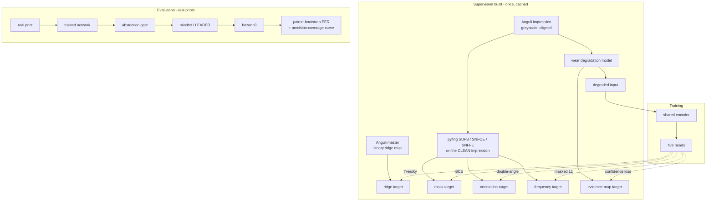

# feat: Wear-aware abstaining fingerprint enhancement

## Summary

Build the thesis's single contribution across four working weeks: a physiologically grounded
wear degradation model that emits its own supervision, a unified network that estimates
segmentation, orientation, frequency, an enhanced ridge map and per-pixel confidence in one
forward pass, an abstention mechanism that refuses to reconstruct where evidence was
destroyed, and the ablations and benchmark that measure all of it. Week 1 — harness, NBIS,
baselines — is already done and is treated as given.

---

## Problem Frame

The origin document establishes the research argument; this plan does not restate it. What
matters for planning is what week 1 changed and what investigation since has revealed.

**Week 1 outcomes that constrain this plan.** NBIS builds and runs, so `bozorth3` EER is
available as the headline metric. `pyfing` runs on the PyTorch backend with all five
pretrained models bundled, so Cappelli's estimators are usable as components rather than
merely as baselines. Baselines are in the registry: on the full FVC2004, no enhancement
gives EER 0.0991, GBFEN 0.0955, SNFEN 0.0895. Every interval overlaps the control.

**Three discoveries that change the plan.**

First, **R4's premise is wrong**. Anguli's `Meta Info` exports only pattern type and singular
points — no orientation field, no frequency map. The origin document assumed the generator
supplies them. It does not, and the supervision has to come from somewhere else.

Second, **the Anguli master is binary** — two grey levels at 275×400 — which is exactly the
near-binary white-ridges-on-black target Cappelli constructs by hand from annotated
skeletons. The reconstruction target is therefore free and already correct in form. The
impressions are greyscale and **pixel-aligned** with the master, because generation ran with
translation and rotation both zero. Each source has a natural role: the greyscale impression
is what gets degraded and fed in, the binary master is what the network must reproduce.

Third, **comparing independent bootstrap intervals is the wrong test**. All conditions score
the *same* pairs, so the marginal intervals from week 1 are far weaker than the paired
comparison the data supports. This is why no baseline difference resolved, and it will
equally obscure our own results unless fixed.

---

## Requirements

Traceability to the origin document. Requirements not listed here are satisfied by week 1
work already in the registry.

| Origin | Covered by |
|---|---|
| R1 wear effects, parametric and physiologically grounded | U1 |
| R2 per-image record, reproducible from seed | U1 |
| R3 per-pixel evidence map | U1 |
| R4 ground-truth segmentation, orientation, frequency | U2 — **premise corrected**, see Key Technical Decisions |
| R5 realism validated by NFIQ 2 test and domain classifier | U3 |
| R6 controlled severity over real clean prints | U1, U12 |
| R7 one network, five heads, one forward pass | U5 |
| R8 orientation periodicity respected | U5, U6 |
| R9 confidence trained against the evidence map | U6, U7 |
| R10 asymmetric loss penalising false ridges | U6 |
| R11 ≤10M params, ≤500 ms CPU, ≤4 GB training | U5, U7 |
| R12 no test-set material in training | U2 — satisfied structurally |
| R13 coverage threshold, per-pixel decision | U8 |
| R14 minutiae in declined regions discarded and counted | U8 |
| R15 threshold swept at evaluation time | U9 |
| R16 EER with intervals | U11 — upgraded to paired bootstrap |
| R17 two independent open matchers | U11 — **resolved as extractor independence** |
| R18 NFIQ 2 distribution shift | done in week 1 |
| R19 minutiae precision vs synthetic pseudo-GT | U9 |
| R20 failure-to-acquire reduction | done in week 1 |
| R21 stratified by severity and finger position | U12 |
| R22 baselines run by us | done in week 1 |
| R23 ablations on four axes | U10 |
| R24 every number script-produced into the registry | done in week 1 |
| AE1–AE5 | U8, U9, U3, U5 respectively |

---

## Key Technical Decisions

**Orientation and frequency supervision comes from pyfing run on the clean impression.**
R4's assumption failed, and of the two repairs available this is the stronger. Cappelli's
SNFOE and SNFFE were trained on manual annotation; running them on a *clean* image and using
the result to supervise a student that sees a *degraded* one is knowledge distillation from a
validated teacher, and it inherits his annotation quality without needing his labels. The
alternative — computing fields classically from the binary master — would require validating
our own estimator, which is a week we do not have. The cost is honest and must be stated in
the thesis: our orientation and frequency "ground truth" is another model's output on clean
data, not human annotation, so those two heads are evaluated as agreement-with-teacher rather
than as absolute accuracy. The ridge-map and confidence heads are unaffected, and they carry
the thesis's claims.

**Input is the degraded impression; target is the binary master.** The impression supplies
realistic acquisition variation and is in-distribution for the pyfing teachers; the master
supplies a clean binary reconstruction target in the same form Cappelli uses. They are
pixel-aligned, so no registration step is needed. Degrading the binary master directly would
produce an unrealistic input, and using the impression as target would ask the network to
reproduce acquisition noise.

**R17 is satisfied by varying the extractor, not the matcher.** SourceAFIS is Java/.NET only
and MCC or OpenAFIS would need building. More importantly, spurious minutiae — the thing this
thesis is about — originate in *extraction*, not matching, so a second matcher fed by the same
`mindtct` templates would test the less interesting axis. The second chain is pyfing's LEADER
end-to-end extractor into `bozorth3`. It is already installed, and it answers the question
that matters: are our gains an artefact of one extractor's behaviour? The deviation from
R17's literal wording is recorded in the thesis.

**Training data is synthetic only; real data is evaluation only.** This satisfies R12
structurally rather than procedurally — no real fingerprint appears in training at all, so no
test image can leak, and the claim needs no auditing. Anguli fingers are split by finger id
so a finger's master and all its impressions land in the same split.

**A flat precision–coverage curve is reported, not engineered around.** If abstention does not
trade coverage for precision, that is the falsification of the thesis's central falsifiable
claim and is reported as such. No pivot is triggered.

**The network is SNFEN's shape with more heads, deliberately.** The origin document's whole
argument is that novelty in architecture is where returns have gone. Five-level encoder-decoder,
5×5 convolutions, skip connections, ~5M parameters. What changes is the head count and the
supervision, not the blocks.

**Trained from scratch, not initialised from SNFEN's released weights.** The weights are in
the venv and warm-starting would be nearly free, so the choice needs stating. Three reasons
against. SNFEN takes a five-channel input (image, mask, two orientation channels, frequency)
because its estimates are computed upstream; ours takes the image alone, so the stem does not
correspond and only the interior would transfer. Its decoder feeds one head, not five. And
the thesis's claim is about what the network is trained *on* — warm-starting from a model
trained on latent-style FVC data would contaminate exactly the comparison U10 exists to make,
and a reviewer would be right to ask which result came from the initialisation. Training is
cheap enough here — SNFEN itself trained in 25 minutes on 360 images — that the clean
comparison is worth more than the saved time. Recorded because it is the obvious shortcut and
its absence would otherwise read as an oversight.

---

## High-Level Technical Design

Data flow from corpus to metric. The wear model is the only source of supervision for four of
the five heads, which is what makes the confidence head trainable at all.



The evidence map is the load-bearing arrow. It exists only because the degradation is ours,
and it is what separates this from adding an uncertainty head to someone else's model.

---

## Output Structure

New files this plan creates. Existing modules from week 1 are not shown.

```text
src/fpe/
  degradation/
    wear.py              wear degradation model + evidence map
    validate.py          realism measurements
  data/
    anguli.py            corpus indexing, splits by finger id
    dataset.py           streaming patch dataset
  models/
    wafen.py             the unified network
    losses.py            per-head losses
    leader.py            pyfing LEADER as an extractor
  train.py               training loop
  eval/
    abstain.py           coverage threshold, minutiae gating
  metrics/
    minutiae.py          precision/recall against pseudo-GT
scripts/
  build_supervision.py   one-off cached label build
experiments/
  validate_wdm.py
  train_wafen.py
  precision_coverage.py
  ablate.py
  benchmark.py
configs/
  wafen_base.yaml
  wdm_default.yaml
```

---

## Phase A — Wear model and supervision (week 2)

### U1. Wear degradation model with evidence map

**Goal.** Parametric, physiologically grounded degradation that records what it did and how
much ridge evidence it destroyed at each pixel.

**Requirements.** R1, R2, R3, R6.

**Dependencies.** None.

**Files.** `src/fpe/degradation/wear.py`, `configs/wdm_default.yaml`,
`tests/test_wear.py`.

**Approach.** Four independently parameterised effects, each with a cited mechanism: ridge
amplitude attenuation (contrast compression toward local mean, spatially varying), flexion
crease injection (elongated low-amplitude valleys following a smooth path), dryness
fragmentation (ridge breaks correlated along ridge direction, not isotropic noise), and
pressure-dependent partial contact (a smooth contact field attenuating toward the periphery).
Mirror the structure of `src/fpe/degradation/latent.py`, which already implements the
nine-artefact control model with per-image records and seeding — that is the pattern to
follow, including its dataclass config and record type.

The **evidence map** is the new concept: a float32 array in [0,1] giving the fraction of local
ridge contrast surviving at each pixel, computed analytically from the effects applied rather
than by comparing images. Amplitude attenuation multiplies it, creases and full contact loss
zero it, fragmentation reduces it where breaks land. Severity is a single scalar in [0,1]
scaling all four effects, so R6's controlled severity levels are one parameter.

**Patterns to follow.** `src/fpe/degradation/latent.py` for config dataclass, seeding, and
the per-image artefact record. `src/fpe/degradation/backgrounds.py` for split discipline.

**Test scenarios.**
- Same seed and same input reproduce byte-identical output and an identical record.
- Different seeds produce different output from the same input.
- Each of the four effects, enabled alone at severity 1.0, visibly changes the image and
  reduces the evidence map; disabled, it leaves both untouched.
- Evidence map is float32, shaped like the input, and stays within [0,1] under every severity
  from 0 to 1 in steps of 0.1.
- Severity 0 is the identity transform and leaves the evidence map all ones.
- Severity monotonicity: mean evidence is non-increasing as severity rises, over a sample of
  seeds.
- Crease injection produces connected elongated structures, not isolated pixels — checked by
  connected-component elongation, not by eye.
- Applied to a real greyscale print (not just synthetic), output dtype and range are valid.

**Verification.** A severity sweep on one image renders left-to-right with visibly increasing
damage and a matching evidence map, and the record explains each panel.

### U2. Supervision build and splits

**Goal.** Turn 5,584 Anguli fingers into cached training tensors, split so no finger crosses
splits.

**Requirements.** R4, R12.

**Dependencies.** U1.

**Files.** `src/fpe/data/anguli.py`, `scripts/build_supervision.py`,
`docs/datasets/manifests/anguli_dev_5584.csv`, `tests/test_anguli_splits.py`.

**Approach.** Index the corpus (`Fingerprints/fp_N/*.png` masters, `Impression_{1,2,3}/fp_N/*.png`
impressions, aligned and same-shaped — verified). For each impression, run pyfing SUFS, SNFOE
and SNFFE **on the clean image** under `torch.no_grad()` and cache mask, orientation and
frequency as compressed `.npy`; the binary master is the ridge target. Store one `.npz` per
sample under `data/processed/supervision/` (gitignored). Splits are assigned by hashing the
finger id, so they are deterministic, need no split file to be kept in sync, and cannot place
a master in one split and its impression in another.

This unit also emits an **Anguli manifest** in the same column format as the existing dataset
manifests, because the week-1 evaluation harness reads manifests and Anguli has none — without
it, U7 has no way to measure a trained model and U9 has no pairs to sweep. Three impressions
per finger give C(3,2) = 3 genuine pairs per finger, and the existing filename-scoped identity
parser already handles the `fp_N/M.png` layout once the manifest exists. Only the held-out test
split is written to the manifest, so the harness cannot be pointed at training fingers by
accident.

Budget: roughly 16,750 impressions at ~4 s of teacher inference each is a long single-threaded
pass. Make the script resumable and chunked, cap worker count at 2 per the RAM constraint, and
allow `--limit` so downstream units can start against a subset before the full build finishes.

**Patterns to follow.** `src/fpe/models/pyfing_baseline.py` for the `torch.no_grad()` wrapper
and model reuse. `scripts/reconcile_anguli.py` for resumable corpus walks that tolerate
interruption — this machine has already killed one long run.

**Test scenarios.**
- Split assignment is deterministic across processes and runs for the same finger id.
- No finger id appears in more than one split; master and all three impressions share a split.
- Split proportions land within a tolerance of the requested ratios over the full corpus.
- A built sample loads with the expected keys, dtypes and shapes, all spatially consistent.
- Orientation cache is within [-π/2, π/2]; mask is binary; ridge target is binary.
- Re-running the script skips already-built samples and does not rewrite them.
- An interrupted build leaves no partially written `.npz` that later loads as valid.
- `--limit N` produces exactly N samples.
- The emitted manifest parses through the existing identity parser, yielding one finger per
  `fp_N/M` with exactly three impressions and three genuine pairs.
- The manifest contains only test-split fingers; no training finger id appears in it.

**Verification.** A subset build completes, a random sample renders as a five-panel figure
(impression, mask, orientation, frequency, master) that is mutually consistent, and the
week-1 baseline entrypoint runs end to end against the Anguli manifest producing an EER.

### U3. Realism validation and the comparison figure

**Goal.** Measure whether wear-degraded output resembles real degraded prints, and report the
answer whichever way it falls.

**Requirements.** R5. Covers AE4.

**Dependencies.** U1.

**Files.** `src/fpe/degradation/validate.py`, `experiments/validate_wdm.py`,
`tests/test_validate.py`.

**Approach.** Two measurements, both into the registry. First, a two-sample Kolmogorov–Smirnov
test between NFIQ 2 score distributions of wear-degraded synthetic prints and real degraded
prints (FVC2004 DB1_B and DB3_B), with the latent-degradation model as the control arm — the
comparison of interest is whether wear degradation is *closer* to real than latent degradation
is, not whether it is indistinguishable. Second, a small domain classifier trained to separate
generated from real; accuracy near chance is the good outcome and accuracy well above chance
is a reported limitation. Keep the classifier deliberately small and log its accuracy with a
confidence interval, since a strong classifier will separate on resolution artefacts rather
than realism.

The figure reuses the layout of `results/figures/latent_degradation_examples.png` so the two
degradation models read side by side, with a third row for real prints.

**Execution note.** Write the reporting path before the classifier, so a poor result cannot be
quietly discarded — AE4 commits us to reporting it.

**Test scenarios.**
- KS statistic is 0 and p is 1 for a distribution against itself.
- KS statistic approaches 1 for two clearly disjoint distributions.
- The domain classifier reaches near 1.0 accuracy on a trivially separable synthetic case,
  confirming the harness can detect separation when it exists.
- Classifier accuracy is reported with an interval, and a near-chance result is not reported
  as success.
- The validation entrypoint writes a registry row even when the outcome is unfavourable.

**Verification.** A three-row figure exists and a registry row carries both measurements.

---

## Phase B — The network (week 3)

### U4. Streaming patch dataset

**Goal.** Feed training from cached supervision without loading the corpus into 7.8 GB of RAM.

**Requirements.** R11.

**Dependencies.** U2.

**Files.** `src/fpe/data/dataset.py`, `tests/test_dataset.py`.

**Approach.** A torch `Dataset` that memory-maps or lazily loads one `.npz` per item, applies
the wear model on the fly at a sampled severity (so every epoch sees fresh degradation — the
model is cheap and this is better than caching degraded copies), and crops a 256×256 patch.
Patch sampling is biased toward the foreground mask so batches are not dominated by
background. Augmentation follows Cappelli's fingerprint-specific set — small translation,
rotation, scale, flip, gamma — applied consistently to image and all four targets, with
orientation values rotated, not merely resampled. Dataloader workers default to 2, never
higher, per the RAM constraint.

**Patterns to follow.** The RAM discipline recorded in `PROJECT_RULES.md` non-negotiable 6.

**Test scenarios.**
- Rotating a sample by a known angle rotates the orientation target by the same angle, modulo π
  — the single easiest thing to get wrong and the most damaging.
- Horizontal flip negates orientation correctly.
- Image and all targets stay spatially aligned under every augmentation.
- A returned batch has the expected shapes, dtypes and value ranges.
- Foreground-biased sampling yields patches whose mean mask coverage exceeds uniform sampling
  over a sample of draws.
- Same seed reproduces the same patch and same degradation.
- Resident memory over a full epoch of iteration stays flat — no accumulation.
- A sample whose cached file is missing or corrupt raises rather than yielding zeros.

**Verification.** One epoch iterates over the training split within the memory budget.

### U5. The unified network

**Goal.** One network, five heads, inside the parameter and latency budget.

**Requirements.** R7, R8, R11. Covers AE5.

**Dependencies.** None (can proceed against synthetic tensors while U2 builds).

**Files.** `src/fpe/models/wafen.py`, `configs/wafen_base.yaml`, `tests/test_wafen.py`.

**Approach.** Five-level encoder-decoder with 5×5 convolutions, batch norm, ReLU, 2×2
max-pool and upsampling, skip connections between corresponding levels — SNFEN's published
shape, chosen because the origin document's argument is that architectural novelty is not
where returns are. Heads operate at full resolution off the shared decoder: segmentation
(1 channel, sigmoid), orientation (**2 channels, the double-angle representation** — this is
how R8's periodicity is respected, and it matches what SNFEN consumes as input), frequency
(1 channel, linear), ridge map (1 channel, sigmoid), confidence (1 channel, sigmoid).

Width is set so the total lands near 5M parameters. The model asserts its own parameter count
against the configured budget at construction, so an over-budget configuration fails loudly
rather than silently becoming out of scope.

**Test scenarios.**
- Parameter count is under 10M and the assertion fires for a deliberately over-wide config.
- Forward pass on a 256×256 input returns five outputs of the documented shapes.
- Forward pass accepts non-square and non-power-of-two sizes, or fails with a clear message.
- Sigmoid-headed outputs are within [0,1]; the orientation head's two channels are decodable
  to an angle in [-π/2, π/2].
- Backward pass produces finite gradients on every head.
- Single-image CPU inference is measured and recorded — R11's 500 ms budget is a reported
  number, and week 1 measured the four-network chain it must beat at ~1.05 s.
- Peak GPU memory for a batch of 8 at 256×256 with mixed precision stays under 4 GB.

**Verification.** Parameter count, CPU latency and peak memory are all printed and inside
budget.

### U6. Losses

**Goal.** One loss per head, with the asymmetry the precision argument requires.

**Requirements.** R9, R10.

**Dependencies.** U5.

**Files.** `src/fpe/models/losses.py`, `tests/test_losses.py`.

**Approach.** Ridge map uses the Tversky index with α = 0.7, computed inside the foreground
mask, penalising false ridges more heavily than missed ones — Cappelli's formulation and the
direct expression of the precision-first stance. Orientation uses a double-angle loss so that
0 and π are the same. Frequency uses masked L1. Segmentation uses BCE. Confidence regresses
the evidence map, masked to the foreground.

Head weighting is a deferred implementation question (see Open Questions) — start with fixed
weights that normalise each term to a comparable scale, and only reach for learned uncertainty
weighting if fixed weights visibly starve a head.

**Test scenarios.**
- Tversky is 0 for a perfect prediction and 1 for a fully inverted one.
- Tversky with α = 0.7 penalises a false positive more than a false negative of equal area —
  asserted numerically, since this is the whole point of choosing it.
- Tversky ignores everything outside the mask.
- Orientation loss is 0 for a prediction offset by exactly π and maximal at π/2 — the
  periodicity property, which a plain regression loss would fail.
- Frequency loss ignores masked-out regions.
- Confidence loss is 0 when the prediction equals the evidence map.
- Every loss is finite for degenerate inputs: an all-zero mask, an all-ones target, an
  all-zero prediction.

**Verification.** All losses decrease when a prediction is perturbed toward its target.

### U7. Training loop and first trained model

**Goal.** A trained network that beats the no-enhancement control, with the run in the registry.

**Requirements.** R11, R24.

**Dependencies.** U4, U5, U6.

**Files.** `src/fpe/train.py`, `experiments/train_wafen.py`, `tests/test_train.py`.

**Approach.** Mixed precision, gradient accumulation to reach an effective batch larger than
4 GB allows directly, cosine schedule with warm-up, fixed epoch count following SNFEN's
economy rather than long training. Checkpoint on best validation ridge-map Tversky. Every run
writes a registry row carrying the config hash, so training runs are as traceable as
evaluation runs. Log per-head losses separately — a head silently failing to learn is the most
likely failure mode of the whole plan, and an aggregate loss hides it.

**Execution note.** Get one over-fit-on-ten-samples run working before any full run. If the
network cannot memorise ten samples, no amount of training data will help, and this is a
five-minute check versus an hour-long one.

**Test scenarios.**
- Ten samples can be over-fit to near-zero loss — the correctness canary for wiring.
- Training for two steps on a tiny subset runs end to end and writes a checkpoint.
- Resuming from a checkpoint reproduces the optimiser and schedule state.
- Peak memory over several steps stays under 4 GB.
- The registry row contains the config hash, git SHA and per-head losses.
- A config that violates the parameter budget fails before training starts, not after an hour.

**Verification.** A trained checkpoint exists and its enhanced output, run through the week-1
harness, produces an EER at or below the no-enhancement control on the validation split.

---

## Phase C — Abstention and ablations (week 4)

### U8. Abstention and confidence-gated minutiae

**Goal.** Refuse to reconstruct where evidence was destroyed, and keep those refusals out of
the template.

**Requirements.** R13, R14. Covers AE1.

**Dependencies.** U7.

**Files.** `src/fpe/eval/abstain.py`, `tests/test_abstain.py`.

**Approach.** Threshold the confidence map into a binary coverage mask; in declined regions
write background rather than predicted ridges, so the extractor sees absence of evidence
rather than invented structure. After extraction, drop minutiae whose coordinates fall in a
declined region and record how many were dropped. Expose this as a `preprocess` callable with
the same signature the week-1 harness already accepts, so no evaluation code changes.

**Test scenarios.**
- Covers AE1. A print with a region destroyed by the wear model yields no minutiae inside that
  region at the default threshold.
- Threshold 0 declines nothing and reproduces the un-gated output exactly.
- Threshold 1 declines everything and yields an empty template — which must be handled as a
  failure to acquire, not a crash.
- Dropped-minutiae counts are recorded and equal the number falling in declined regions.
- Coverage fraction is computed over the foreground mask, not the whole image — otherwise
  image padding inflates it.
- A minutia exactly on a coverage boundary is handled deterministically.

**Verification.** Coverage fraction and dropped count appear in the registry row.

### U9. Minutiae precision and the precision–coverage curve

**Goal.** The thesis-defining figure.

**Requirements.** R15, R19. Covers AE2.

**Dependencies.** U8.

**Files.** `src/fpe/metrics/minutiae.py`, `experiments/precision_coverage.py`,
`tests/test_minutiae.py`.

**Approach.** Implement Cappelli's correspondence protocol exactly — 14-pixel Euclidean
threshold, π/9 direction threshold, both type-exact and type-agnostic — with greedy one-to-one
assignment, against pseudo ground truth extracted from the clean Anguli master. Every reported
figure is labelled synthetic; the origin document forbids presenting these as comparable to
published SD27 numbers. Then sweep the abstention threshold and plot precision and EER against
coverage, with every baseline drawn as a single point at coverage 1.0.

**Test scenarios.**
- A template matched against itself scores precision and recall 1.0.
- A template offset by 13 pixels matches; 15 pixels does not — the threshold boundary.
- A template rotated by just under and just over π/9 matches and fails respectively.
- Type-exact and type-agnostic differ on a template where only the types were changed.
- Assignment is one-to-one: two ground-truth minutiae cannot both claim one detection.
- An empty template yields precision 0 without dividing by zero.
- The curve has one point per swept threshold and coverage decreases monotonically as the
  threshold rises.

**Verification.** `results/figures/precision_coverage.png` exists with our curve and every
baseline as a point.

### U10. Ablations

**Goal.** Isolate each claimed source of gain.

**Requirements.** R23.

**Dependencies.** U7, U9.

**Files.** `experiments/ablate.py`, `configs/` variants.

**Approach.** Four axes, one variable at a time, each a full train-and-evaluate run into the
registry: wear-degraded versus latent-degraded training data (the control arm already exists
in `src/fpe/degradation/latent.py`); joint estimation versus frozen pretrained pyfing
estimators feeding only the enhancement head — which is also the Approach A fallback, so this
ablation doubles as the fallback's evaluation; abstention on versus off; Tversky α = 0.7
versus symmetric Dice. Budget roughly an hour per run, so all four fit inside week 4 with room
to repeat one.

**Test scenarios.** No new behaviour — this unit composes tested pieces. Verify instead that
each ablation config differs from the base in exactly one field, asserted programmatically
rather than by reading the YAML, so a two-variable "ablation" cannot be reported as one.

**Verification.** Four registry rows, each traceable to its config hash, and a generated
ablation table.

---

## Phase D — Benchmark (week 5)

### U11. Paired bootstrap and the second extraction chain

**Goal.** Make the comparison powerful enough to resolve, and test whether results survive a
different extractor.

**Requirements.** R16, R17.

**Dependencies.** U8.

**Files.** `src/fpe/metrics/matching.py` (extend), `src/fpe/models/leader.py`,
`tests/test_matching.py` (extend), `tests/test_leader.py`.

**Approach.** Add a paired bootstrap over the EER *difference* between two conditions,
resampling **pairs** rather than scores and carrying both conditions' scores for the same
resampled pairs — this is the powered test the week-1 baselines needed and did not have, and
it is what will decide whether our own result is real. Report the difference with its interval
and state whether it excludes zero.

Separately, wrap pyfing's LEADER as a second extractor producing `.xyt` templates for
`bozorth3`, giving a second chain that varies extraction — where spurious minutiae actually
originate.

**Test scenarios.**
- Paired bootstrap on two identical score sets gives a difference of exactly 0 with an interval
  containing 0.
- Paired bootstrap on a large constructed difference excludes 0.
- The paired interval is narrower than the difference of the two marginal intervals on real
  week-1 data — the entire justification for the change, asserted rather than assumed.
- Resampling is paired: the same pair indices are used for both conditions within a resample.
- LEADER produces a template parseable by the existing `.xyt` reader.
- LEADER and mindtct on the same clean image both produce a plausible minutia count, and both
  chains run end to end into an EER.

**Verification.** The week-1 baseline comparison is re-reported with paired intervals, and at
least one previously unresolved comparison either resolves or is confirmed genuinely null.

### U12. Full benchmark, stratification, figures and tables

**Goal.** The results chapter, generated.

**Requirements.** R6, R21, R24. Covers AE3.

**Dependencies.** U9, U10, U11.

**Files.** `experiments/benchmark.py`, `scripts/make_tables.py` (extend),
`scripts/make_figures.py`.

**Approach.** Sweep every method — no enhancement, GBFEN, SNFEN, ours at several coverage
levels — across every real evaluation set, plus real clean prints degraded by the wear model
at three severities (R6's replacement for the excluded SOCOFing severity axis). Stratify by
severity and by finger position, using MINEX's labelled positions. Extend the existing table
generator rather than writing a second one; every number comes from the registry.

**Test scenarios.**
- Covers AE3. Severity-stratified output contains one row per severity level with the trend
  visible across them.
- Finger-position stratification covers every position present in the manifest.
- A condition missing from the registry is reported as absent rather than silently omitted
  from the table.
- Table generation is deterministic for a fixed registry.

**Verification.** Tables and figures regenerate from a clean checkout plus the registry, with
no manual editing.

---

## Scope Boundaries

**In scope.** Everything in Phases A–D above, satisfying the origin document's requirements as
traced in the Requirements table.

**Deferred to follow-up work.**
- A genuinely independent second *matcher* (MCC or OpenAFIS, both now buildable given the
  week-1 toolchain). Extractor independence covers R17's intent for this thesis.
- Rebuilding NBIS with PNG support, removing the lossless-JPEG conversion step.
- Updating the x64 MSVC redistributable to unblock modern PyTorch; torch 2.5.1 is sufficient
  for a ~5M-parameter model on a GTX 1650.
- Scaling the Anguli corpus beyond 5,584 fingers, unless a measurement shows it is needed.

**Out of scope, per the origin document.** Multi-impression fusion; the post-hoc
domain-alignment and unpaired-translation comparison arms; demographic stratification (no
acquired dataset carries the labels); latent fingerprint enhancement.

---

## Risks and Mitigation

| Risk | Severity | Mitigation | Trigger |
|---|---|---|---|
| Multi-task training will not converge; a head starves | High | Per-head loss logging from the first run; ten-sample over-fit canary before any full run; Approach A fallback is U10's second ablation, so it is already built and evaluated | End of week 4 |
| Teacher labels are wrong on degraded-looking synthetic images | Medium | Teachers run on the *clean* impression only, never the degraded one; a sample of teacher outputs is inspected in U2's verification figure | Week 2 |
| Wear model realism is poor | Medium | AE4 commits us to reporting it; the wear-vs-latent comparison is a result either way | Week 2 |
| Precision–coverage curve is flat | Medium | Reported as the falsification of a stated falsifiable claim, per the user's decision. No pivot | Week 4 |
| Supervision build is too slow to finish week 2 | Medium | Resumable, chunked, `--limit` lets Phase B start on a subset; teachers are the cost, and they run once | Week 2 |
| Anguli's 5,584 fingers prove insufficient | Low | SNFEN trained on 360 images; scaling is one overnight run | Week 3 |
| Another long run is killed by memory exhaustion | Medium-high | Already materialised once. Workers ≤ 2, streaming dataset, resumable scripts, nothing bulk-loaded | Any run |

---

## Open Questions

**Deferred to implementation.**
- Head loss weighting: fixed normalised weights first, learned uncertainty weighting only if a
  head visibly starves.
- Whether the encoder is fully shared or the estimator heads branch earlier.
- The exact functional form of the evidence map's response to fragmentation.
- Whether the confidence head regresses the evidence map directly or predicts its own error
  against it — U6 starts with the former as the simpler falsifiable choice.
- Whether real clean prints for U12's severity sweep come from Neurotechnology, FVC, or both.

**Resolved during planning.** Orientation and frequency supervision (pyfing teachers on clean
impressions); R17 (extractor independence); flat-curve handling (reported as a finding).

---

## System-Wide Impact

The week-1 harness is extended, not modified: abstention and LEADER both enter through the
existing `preprocess` hook and `.xyt` interfaces, so baseline rows already in the registry stay
comparable. `scripts/make_tables.py` gains stratification but keeps its current output. The
one breaking change is to `src/fpe/metrics/matching.py`, which gains paired-bootstrap functions
alongside the existing marginal ones — additive, so week-1 rows remain reproducible.

`data/processed/supervision/` will hold roughly 16,750 cached samples. It must be gitignored
(covered by the existing `/data/` rule) and must never be indexed by the editor, per the
`.vscode/settings.json` excludes that are already load-bearing.

---

## Sources and Research

- Origin: `docs/brainstorms/2026-09-11-wear-aware-abstaining-enhancement-requirements.md`.
- `literature_review_fingerprint_enhancement.md` §9 for SNFEN's architecture, training economy,
  Tversky α = 0.7, and the results table; §15 for Gaps 1–3.
- `docs/nbis-build.md` for the toolchain and the lossless-JPEG constraint on extractor input.
- `results/registry/runs.jsonl` and `results/tables/baselines.md` for the baselines this work
  must beat.
- Week-1 code as the pattern source: `src/fpe/degradation/latent.py` (degradation model shape),
  `src/fpe/models/pyfing_baseline.py` (teacher invocation under `torch.no_grad()`),
  `src/fpe/eval/baseline.py` (the `preprocess` hook this plan extends).
- Second-matcher survey: SourceAFIS is Java/.NET with no Python port; MCC and OpenAFIS are C++
  and would need building. Basis for resolving R17 as extractor independence.
